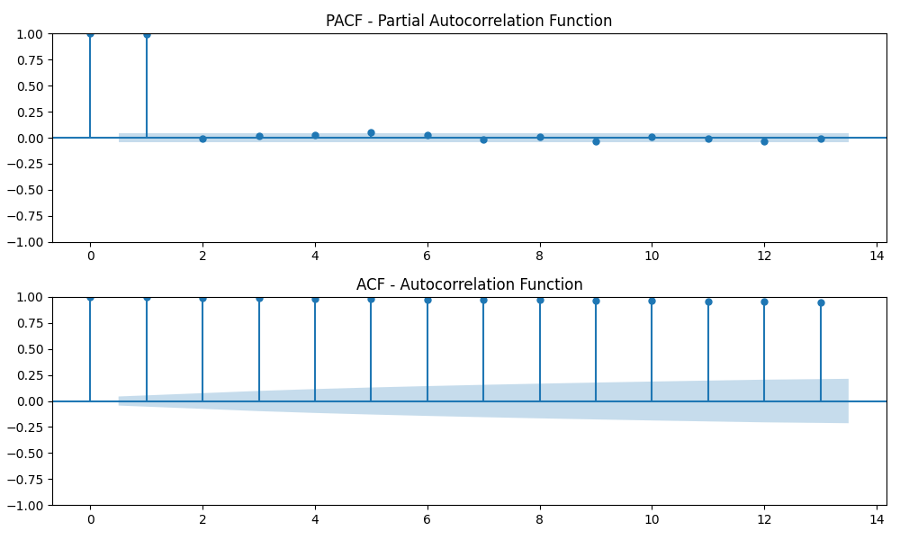

# Developed By: Pranave B
# Register No: 212221240040

# Ex.No: 07                                       AUTO REGRESSIVE MODEL


### AIM:
To Implementat an Auto Regressive Model using Python
### ALGORITHM:
1. Import necessary libraries
2. Read the CSV file into a DataFrame
3. Perform Augmented Dickey-Fuller test
4. Split the data into training and testing sets.Fit an AutoRegressive (AR) model with 13 lags
5. Plot Partial Autocorrelation Function (PACF) and Autocorrelation Function (ACF)
6. Make predictions using the AR model.Compare the predictions with the test data
7. Calculate Mean Squared Error (MSE).Plot the test data and predictions.
### PROGRAM :
```python 
# Import necessary libraries
import pandas as pd
import numpy as np
import matplotlib.pyplot as plt
from statsmodels.tsa.stattools import adfuller
from statsmodels.tsa.ar_model import AutoReg
from statsmodels.graphics.tsaplots import plot_acf, plot_pacf
from sklearn.metrics import mean_squared_error

# Load the Tesla stock data from the CSV file
file_path = 'tsla_2014_2023.csv'
data = pd.read_csv(file_path, index_col='date', parse_dates=True)

# Display the first few rows (GIVEN DATA)
print("GIVEN DATA:")
print(data.head())

# Ensure 'close' prices are numeric and handle NaN values
data['close'] = pd.to_numeric(data['close'], errors='coerce')
data = data.dropna()  # Drop rows with NaN values if any

# Perform Augmented Dickey-Fuller test for stationarity
result = adfuller(data['close'])
print('ADF Statistic:', result[0])
print('p-value:', result[1])

# Split the data into training and testing sets
train_size = int(len(data) * 0.8)
train, test = data[:train_size], data[train_size:]

# Fit an AutoRegressive (AR) model with 13 lags
model = AutoReg(train['close'], lags=13)
model_fit = model.fit()

# Make predictions using the AR model
predictions = model_fit.predict(start=len(train), end=len(train) + len(test) - 1, dynamic=False)

# Calculate Mean Squared Error (MSE)
mse = mean_squared_error(test['close'], predictions)
print('Mean Squared Error:', mse)

# Plot Partial Autocorrelation Function (PACF) and Autocorrelation Function (ACF)
plt.figure(figsize=(10, 6))
plt.subplot(211)
plot_pacf(train['close'], lags=13, ax=plt.gca())
plt.title("PACF - Partial Autocorrelation Function")
plt.subplot(212)
plot_acf(train['close'], lags=13, ax=plt.gca())
plt.title("ACF - Autocorrelation Function")
plt.tight_layout()
plt.savefig('tesla_acf_pacf_plots.png')
plt.show()

# Display predictions
print("PREDICTION:")
print(predictions)

# Plot the test data and predictions (FINAL PREDICTION)
plt.figure(figsize=(10, 6))
plt.plot(test.index, test['close'], label='Actual Price')
plt.plot(test.index, predictions, color='red', label='Predicted Price')
plt.title('Test Data vs Predictions (FINAL PREDICTION)')
plt.xlabel('Date')
plt.ylabel('Price')
plt.legend()
plt.savefig('tesla_final_prediction.png')
plt.show()

```
### OUTPUT:

GIVEN DATA:


PACF - ACF



FINIAL PREDICTION


### RESULT:
Thus we have successfully implemented the auto regression function using python.
